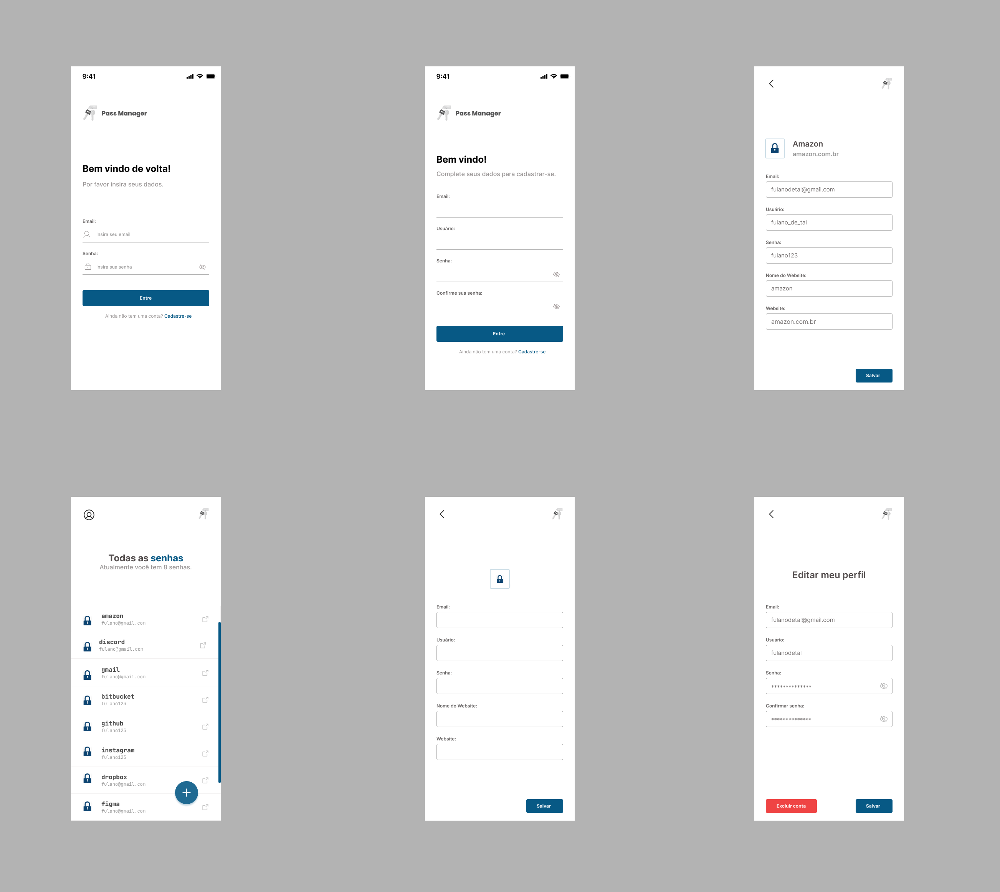

# Pass Manager Frontend

This repository contains the source code of PWA application for a password manager Frontend built using [Angular](https://angular.io/)


## 💻 Layout



## 👨‍💻 This project was developed with the following technologies:

### Angular 
Angular is an application-design framework and development platform for creating efficient and sophisticated single-page apps.


### Prerequisites

To use this API, you must have `Node.js` and `Angular CLI` 

### Installation

To install this API, follow these steps:

1. Clone the repository:

```bash
git clone https://github.com/Mateus-Kent/pass-manager-frontend.git
```

2. Navigate to the repository directory:

```bash
cd pass-manager-frontend
```

3. Install the dependencies:
```bash
npm install
```
### Running the app

To run the API, follow this step:

1. You can Run this command 
```bash
npm start-pwa 
```


This project was made for the delivery of the interdisciplinary project of the FECAP faculty in the field of analysis and development of systems
